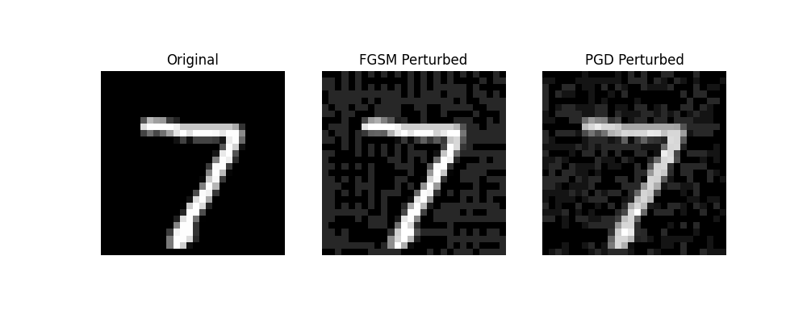

# Out-of-Distribution (OOD) Detection

## Introduction

## **ODIN hyperparameters**
<span style="font-size: 18px;">I implemented the [ODIN](https://arxiv.org/abs/1706.02690) method for the detection of out of distribution images, finding of this work is that applying temperature scaling and introducing small perturbations to the input helps distinguish the softmax score distributions of in-distribution and out-of-distribution images, making detection more effective.
For this lab, I used the ResNet-44 model pretrained on CIFAR-10, which can be downloaded via torch.hub.load. As the out-of-distribution dataset, I generated a dataset using the FakeData method from torchvision.datasets.
My objective was to study the hyperparameters temperature and epsilon of ODIN using a grid search. To evaluate the network's ability to distinguish out-of-distribution images, I measured the ROC AUC score for each couple of hyperparameters.
<br><br>

<span style="font-size: 18px;">Here, I present a heatmap representation of the grid with all the obtained results. As we can observe, there doesn't seem to be a specific hyperparameter dimension that significantly influences the AUC. A near-perfect ROC AUC is achieved around ε = 0.017 and temperature = 1000.
<br><br>


<br><br>

<span style="font-size: 18px;">It is also evident that this method outperforms the baseline approach by [Hendrycks and Gimpel](https://arxiv.org/abs/1610.02136) represented by the top-left square in the heatmap.
For clarity I also report the comparison between the two ROC curves.
<br><br>


<br><br>


## **JARN Implementation for MNIST**

<span style="font-size: 18px;">In this lab, I implemented [JARN](https://arxiv.org/pdf/1912.10185), an adversarial training method that leverages the Jacobian of the loss function with respect to input data as false images. The model, a simple CNN, is trained to minimize the standard cross-entropy loss on MNIST while simultaneously generating adversarial images, the jacobian, capable of deceiving a discriminator network. This procedure aims at training classifiers to produce more meaningful and image-like input Jacobian matrices and this improve their resistance to adversarial examples.See the [original paper](https://arxiv.org/pdf/1912.10185) for a complete explanation. 

<span style="font-size: 18px;">To evaluate the effectiveness of JARN, I trained a CNN using both the 'standard' training method and JARN for a small number of training epochs, limiting the dataset to MNIST for computational simplicity, as I currently lack access to a GPU. The trained models were then tested against MNIST images perturbed using FGSM and PGD, to assess their resistance to adversarial perturbations, see the code for the details of the implementations.

<span style="font-size: 18px;">For illustration, here I show the effect of the attacks on an example image from the dataset:

<br><br>



<br><br>

<span style="font-size: 18px;">As we can see, the performance of the standard network is dramatically degraded, dropping from 0.99 accuracy on the MNIST test set to 0.87 after an FGSM attack and 0.78 after PGD. In contrast, the network trained with JARN shows greater robustness, dropping only to 0.96 accuracy in the worst case.


<table style="width:50%; text-align:center; font-size:18px;">
  <tr>
    <th></th>
    <th>Clean</th>
    <th>FGSM</th>
    <th>PGD</th>
  </tr>
  <tr>
    <td><strong>Standard</strong></td>
    <td>0.99</td>
    <td>0.87</td>
    <td>0.78</td>
  </tr>
  <tr>
    <td><strong>Jarn</strong></td>
    <td>0.98</td>
    <td>0.97</td>
    <td>0.96</td>
  </tr>
</table>


## Usage Instructions

### Prerequisites
torch

### Running the Script
The script supports two main modes: **training** and **testing**.

#### 1. Training the Model
To train the model, use the following command:

```bash
python script.py --mode train --train <standard|jarn>
```

#### 2. Testing the Model
To test the trained model, use the following command, you can choose among the 3 different test:

```bash
python script.py --mode test --test_model <standard|jarn> --test <clean|fgsm|pgd>
```
